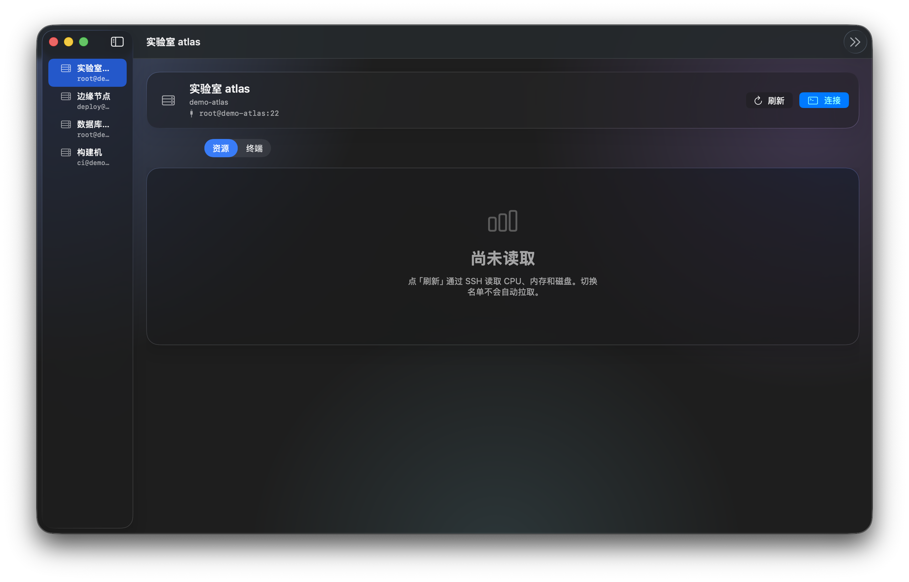

# anny

在 Mac 上看 Tailscale 里的服务器：资源占用，以及一键打开 SSH 终端。

演示界面，主机名和地址是虚构的。

## 它做什么

把常用机器放进左侧名单。点一台，看 CPU、内存和磁盘；或打开终端直接操作。

- **名单**：从本机 Tailscale 节点里勾选加入，也可以手填主机名。只记在 anny 里，不会改 Tailscale。
- **资源**：点「刷新」才读取。换一台机器不会自动拉数据。
- **终端**：点「连接」或双击名单。`⌘T` 连接，`⌘D` 断开。
- **备注**：有备注时名单显示备注，方便认出是哪台。

移出名单只是 anny 不再盯它，节点还在。

## 使用前

- macOS 14 或更新
- 本机已安装并登录 [Tailscale](https://tailscale.com/download)
- 能用密钥免密 SSH 到目标机器（Linux）
